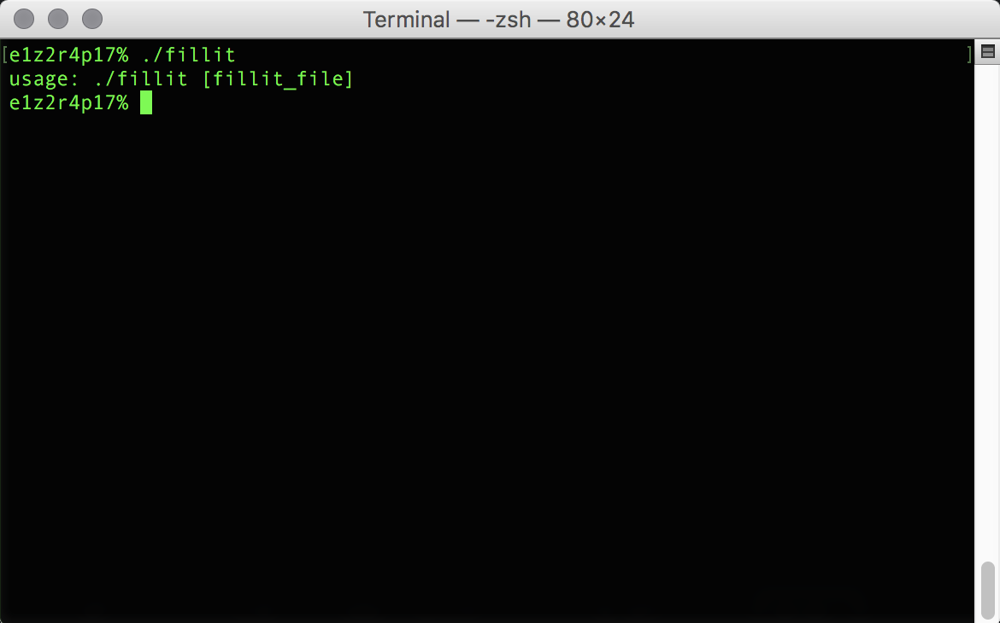
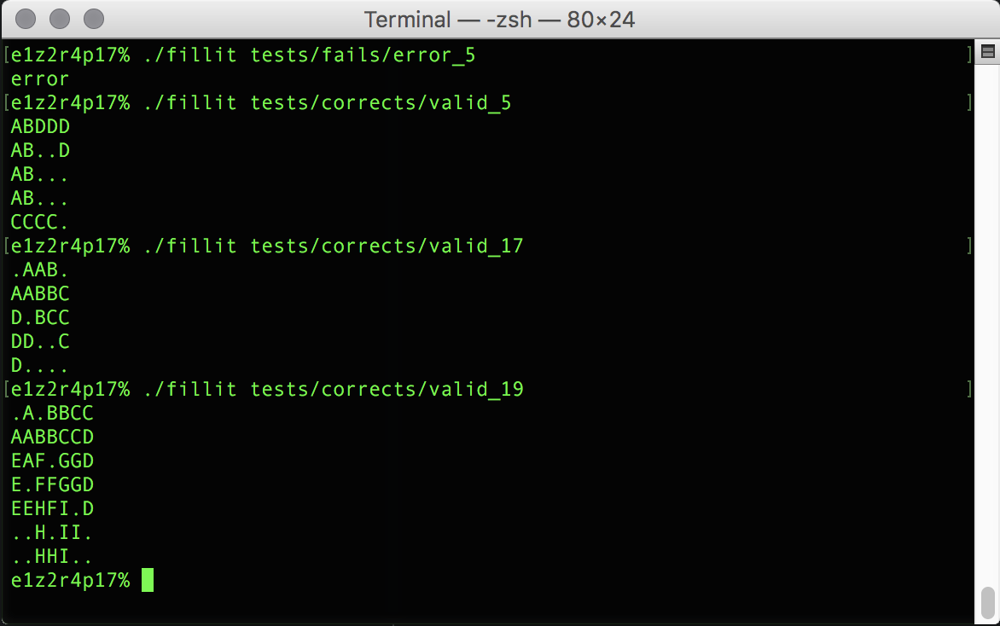

# École 42

## Fillit

This projects seeks in discovering and/or familiarizing a recurring problematic
in programming: searching for the optimal solution among a huge set of
possibilities. In this particular project, the idea is to create an algorithm
which fits some Tetriminos together into the smallest possible square, in the
minimal amount of time, amount of time, despite a exponentially growing
number of possibilities each time a piece is added.

## Getting Started

### Compiling

Run the following commands:

* To compile
	- `make`
* To remove objects:
	- `make clean`
* To remove objects and binary file (program):
	- `make fclean`
* To re-compile:
	- `make re`

### Executing

To execute the program:

`./fillit <fillit-file>`

#### Try it!

Try running the following:

`./fillit tests/fails/error_5`

`./fillit tests/corrects/valid_5`

`./fillit tests/corrects/valid_17`

`./fillit tests/corrects/valid_19`

## Screenshots

**Usage message:**

**Program running:**

